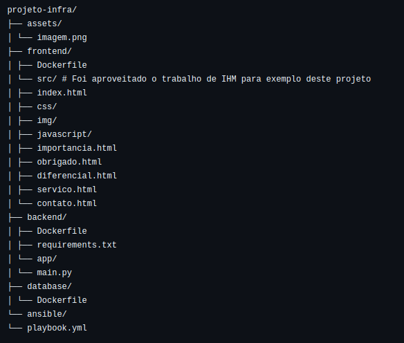
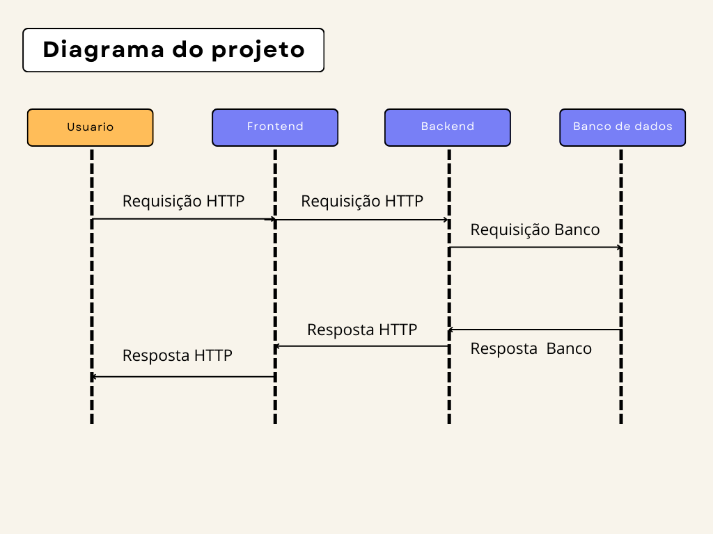

# projeto-infra
Aplicação Web Simples com Contêineres Docker e Ansible para a disciplina de Infraestrutura e Serviços Web.

## Estrutura do projeto:

- O trabalho web pode ser encontrado, completo, aqui: https://replit.com/@JuliaSchaedler/TrabalhoIHM#index.html

## Como funciona este projeto?

- Os contêiners rodam de forma separada e se comunicam através de uma mesma rede.
- O usuário requisita a aplicação Web por algum navegador, usando HTTP, e o frontend recebe esta requisição e processa a lógica da interface, fazendo outras requisições para o backend para obter dados.
- Já o backend recebe esta requisição do frontend, processa a lógica de negócio, acessa o banco de dados para buscar/armazenar algo, e retorna a resposta HTTP para frontend.
- O backend envia a resposta HTTP para o frontend, que a processa e a exibe para o usuário no navegador.

## Requisitos:
- Docker
  -  sudo apt install -y docker.io
  -  sudo systemctl start docker
  -  sudo systemctl enable docker
- Ansible
  -  sudo apt install -y ansible

## Comandos para executar o projeto:
### Essenciais
1. Deletando os contêiners: sudo docker rm -f frontend backend database
2. Verificando contêiners ativos: sudo docker ps
3. Verificando redes ativas: sudo docker network ls
4. Verificando imagens: sudo docker images

### Buildando e rodando manualmente os contêiners:
1. Criando a rede "net"

- sudo docker network create net

2. Rodando o contêiner Frontend:
   
- sudo docker build -t myfrontend ./frontend
- sudo docker run -d --name frontend --network net -p 80:80 myfrontend

3. Rodando o contêiner Backend:
   
- sudo docker build -t mybackend ./backend
- sudo docker run -d --name backend --network net mybackend

4. Rodando o contêiner Database:
   
- sudo docker build -t mydatabase ./database
- sudo docker run -d --name database --network net mydatabase

### Automatizando com Ansible
1. Rodando o Ansible:
    
- sudo ansible-playbook playbook.yml        (no diretório "ansible")
- sudo ansible-playbook ansible/playbook.yml        (no diretório "projeto-infra)

### Acessando o site:
- http://localhost

